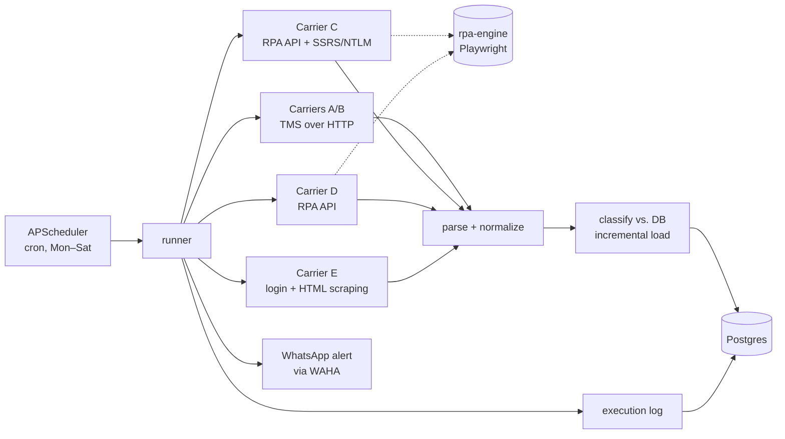

# logistics-sync

An async Python ETL that collects delivery status from several carrier portals, compares it with a Postgres database and writes only what changed. It feeds a logistics control tower (a dashboard with SLA, due dates and at-risk parcels).

It replaced a set of n8n workflows and cut each full sync from **~30 min to ~10 min**.

> **Note:** this is a sanitized copy of a system I built and ran in production at a last-mile logistics company. Carrier names, URLs, endpoints, credentials and client data were removed or replaced with placeholders (`transportadora_a` … `transportadora_e`, `*.example.com`). One carrier integration was left out on purpose. The code comments and identifiers are in Portuguese, the language of the team that used it.

## The problem

The company delivers parcels for several carriers. Each carrier has its own portal and report format, and none of them offers an API. To know which parcels were late or at risk, someone had to open every portal, export reports and cross-check spreadsheets by hand.

The first version automated this with n8n: one workflow per carrier, each downloading the report and upserting rows into Postgres. It worked, but it was slow. n8n processed thousands of rows one by one, and a full cycle took 25–30 minutes. It was also hard to test and version.

## What it does



For each carrier, three times a day:

1. **Extract:** download the carrier's reports. Depending on the portal, that means plain HTTP with session cookies, an NTLM-protected SSRS report, HTML table scraping, or a call to my [RPA API](https://github.com/leoperipolli/rpa-engine) when the portal only works in a real browser.
2. **Transform:** parse CSV/XLSX/HTML, normalize dates, city names and each carrier's status vocabulary into one set of statuses (`recebido`, `em_manifesto`, `em_rota`, `entregue`, `tratativa`).
3. **Load (incremental):** load the last 60 days of that carrier from the database, classify each parcel and run only the write it needs.
4. **Report:** save an execution log with counts per case, and send a WhatsApp message on success or failure.

## Classification keys

Each parcel gets a key built from *where it appears*. Every key maps to one handler, so the rules are explicit and each case can be read and tested in isolation.

Carriers with **two reports** (pending + delivered) use a 3-bit key, `DB | Pending | Delivered`:

| Key | Meaning | Action |
|---|---|---|
| `010` | new pending parcel | insert |
| `001` | delivered, never seen before | insert as delivered |
| `011` | new, but pending *and* delivered | insert as delivered with a conflict note |
| `110` | known and still pending | update status if it changed; flag if due today |
| `101` | known and now delivered | mark delivered and resolved |
| `100` | known but missing from both reports | flag for attention |
| `111` | known, pending *and* delivered | mark delivered with a conflict note |
| `000` | impossible by construction | logged as a classification error |

Carriers with **one report** use a 2-bit key, `DB | Report` (`01` insert, `11` update, `10` flag).

Resolved parcels are skipped, so each run only touches rows that can still change.

## Why I moved from n8n to Python

- **Speed:** n8n handled rows one at a time. Here, all writes of a run go through `asyncio` with a semaphore (`lib/pipeline.py`, max 20 concurrent) over an `asyncpg` pool. A full sync went from ~25–30 min to ~10 min.
- **Per-row error handling:** one bad row is logged and counted as `erro`, and the rest of the batch continues.
- **Reuse:** two carriers use the same TMS, so they share one base class (`TransportadoraDupla`) and differ only in configuration and small overrides. Adding a carrier on a known pattern takes a few hours.
- **Testable and versioned:** parsers and normalizers are plain functions with unit tests.

## Tech stack

Python 3.12 · asyncio · httpx · asyncpg · pandas · BeautifulSoup · APScheduler · pydantic-settings · structlog (JSON logs with correlation id) · pytest · Docker

## Project layout

```
main.py                 scheduler (cron per carrier, graceful shutdown)
cli.py                  manual run: python cli.py run <carrier> [--dry-run]
config.py               settings from environment (.env)
lib/
  pipeline.py           concurrent processing with a semaphore, counts per key
  classificar.py        2-bit / 3-bit classification keys
  normalizar.py         dates, city names, status mapping per carrier
  db.py                 asyncpg pool, queries, execution log (single transaction)
  runner.py             run one carrier: log, notify, persist execution
  tms_client.py         HTTP client for the shared TMS portal
  ssrs.py               3-step SSRS ReportViewer export over NTLM
  rpa_client.py         RPA API client (sync call, falls back to polling on 408, one retry)
  notificar.py          WhatsApp notifications (WAHA)
transportadoras/
  base.py               abstract carrier: buscar_dados() → processar()
  base_dupla.py         two-report carriers + the 8 handlers
  transportadora_*.py   one module per carrier
sql/schema.sql          tables, constraints and triggers
tests/                  parser, normalizer, classification and pipeline tests
```

